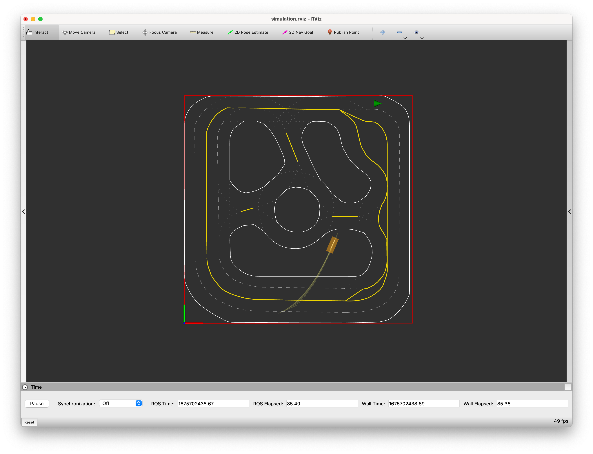

# Lab 0 - Introduction to ROS and RaceCar

## Overview & Goals
1. Get familar with the hardware of the truck.
    - Turn on and off the truck
    - Remote control the truck
    - Replace battery
2. Get familar with the software interface of the truck.
    - Connect to the truck via SSH
    - Run the SLAM and controller nodes
    - Play around with RViz visualization and QRT control panel
4. Learn basic ROS sub/pub
    - Subscribe Odom topic and publish control command
5. Learn ROS parameter server
    - Set the parameters from launch file and command line
    - Set the parameters from yaml file
6. Write a simple P controller to reach a goal

## Get Started
1. Build the workspace from [`ROS_Core`](../..)
```
catkin_make
```
2. Source the workspace
```
source devel/setup.bash
```
if you are using zsh, use
```
source devel/setup.zsh
```
3. Launch the ros packages and rviz visualization
```
roslaunch lab0 lab0_simulation.launch
```
Click the **2D Nav Goal** button on the left panel of RViz, and click on the map to set the goal. You should see a green triangle on the map, which is the goal. At the meanwhile, in the terminal you should also see
```
[INFO] [xxxx.xxx]: Received a new goal [nan, nan]
```

4. Write your code in [`scripts/controller/pure_pursuit.py`](scripts/controller/pure_pursuit.py) and finish all TODOs. Repeat step 3 to see if your controller works.

